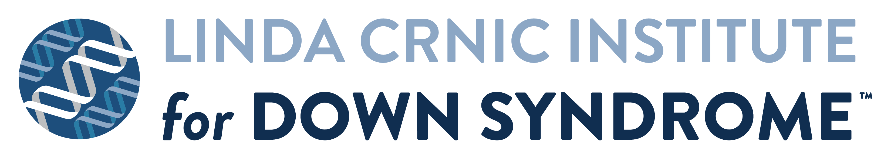

  

# Linda Crnic Institute Data Sciences Program

This GitHub organization serves as a home for code, workflows, and analysis pipelines associated with publications from the **Linda Crnic Institute for Down Syndrome Data Sciences Program**.

## Purpose

This organization hosts and curates component repositories that:
- Support published manuscripts and preprints
- Enable reproducibility of analyses and figures
- Provide reusable code for downstream research
- Facilitate transparent and open science practices

Repositories are generally organized at the level of individual studies, datasets, or analytical components, and may include code for:
- RNA-seq and multi-omics analysis
- Statistical modeling and visualization
- Data processing and harmonization
- Reproducible research workflows

## Scope

The repositories in this organization represent work from the Data Sciences Program at the Crnic Institute and are closely tied to:
- The **Human Trisome Project (HTP)**
- Collaborative efforts within the **INCLUDE (INvestigation of Co-occurring conditions across the Lifespan to Understand Down syndromE) initiative**

## Related Resources

- **Linda Crnic Institute for Down Syndrome**  
  https://medschool.cuanschutz.edu/linda-crnic-institute

- **Human Trisome Project (HTP)**  
  https://www.trisomeproject.org/

- **INCLUDE Data Coordinating Center (DCC)**  
  https://includedcc.org/

## Reproducibility and Use

Where possible, repositories include:
- Documentation sufficient to reproduce primary analyses
- Versioned code corresponding to specific publications
- Links to public data repositories (e.g., GEO, Synapse, dbGaP)

Users should consult individual repositories for:
- Data access requirements
- Software dependencies
- Licensing and reuse terms

## Contact

For questions about specific repositories or collaborations, please refer to the associated publication or repository maintainers.

---

_This organization is maintained as part of ongoing efforts to support open, reproducible, and collaborative research in Down syndrome and related biomedical studies._